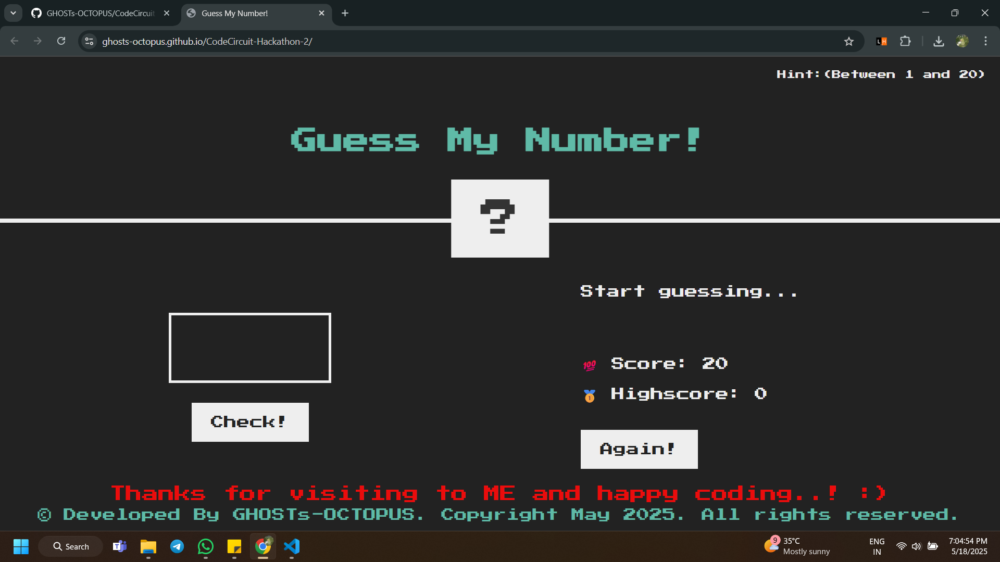

# Number guessing game with hints and win message.
## Description
Number guessing game with hints and win message.

## Technologies used

- HTML
- CSS
- JavaScript

## Screenshots



## Getting Started

### Installation

To run Typing Speed Game locally:

1. Clone the repository:

 ```bash
 git clone [https://github.com/GHOSTs-OCTOPUS/CodeCircuit-Hackathon-2.git]
 ```

 2. Navigate to the project directory:

 ```bash
 cd Projects
 cd "Typing Speed Game"
 ```

 3. Open the **index.html** file in any web browser of your choice. 

 

Credit: [kole vikas](https://github.com/GHOSTs-OCTOPUS)<br>
Last Edited on: 18/05/2025.
